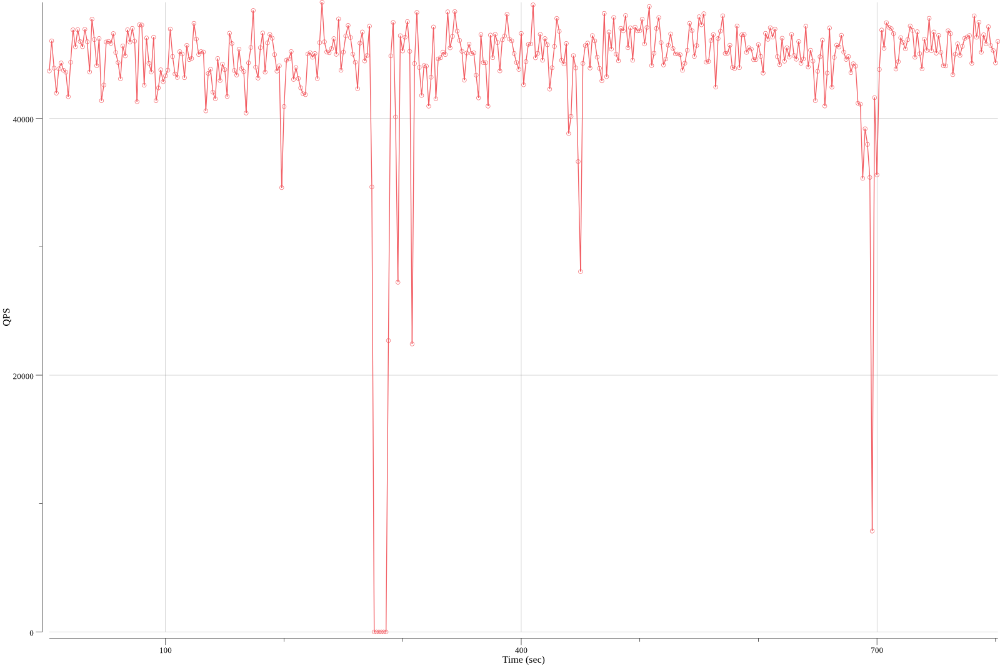

# sysbench-analyzer
A simple tool to analyze sysbench's intermediate results.

It parses sysbench's intermediate results that produced by setting `--report-interval`. Their format is like this:

```
[ 2s ] thds: 256 tps: 2085.94 qps: 43688.92 (r/w/o: 30721.33/8665.87/4301.72) lat (ms,95%): 223.34 err/s: 0.00 reconn/s: 0.00
[ 4s ] thds: 256 tps: 2302.41 qps: 46037.68 (r/w/o: 32209.72/9220.14/4607.82) lat (ms,95%): 186.54 err/s: 0.00 reconn/s: 0.00
[ 6s ] thds: 256 tps: 2217.49 qps: 43919.24 (r/w/o: 30788.82/8697.45/4432.97) lat (ms,95%): 204.11 err/s: 0.00 reconn/s: 0.00
[ 8s ] thds: 256 tps: 2090.02 qps: 41970.30 (r/w/o: 29361.71/8421.56/4187.03) lat (ms,95%): 223.34 err/s: 0.00 reconn/s: 0.00
```

## Usage

### Use the command line tool

Build the binary:

```bash
make
```

Then you can find the binary in `bin` directory.

Currently the tool is very... shabby. 

#### Checking sysbench output

```bash
$ ./sbanalyzer < file # or:
$ ./sbanalyzer check < file
```

It reads content from standard input and check if there is such a set of records (abnormal records) that all of them has lower QPS than 70% of the average value of others (normal records). Abnormal records is never more than half of all the records. All lines that don't match the expected format will be ignored. After analyzing it will print the analyze result to standard out.

For example, assume we have this content in a file:

```
sysbench 1.0.9 (using system LuaJIT 2.0.4)

Running the test with following options:
Number of threads: 256
Report intermediate results every 2 second(s)
Initializing random number generator from current time


Initializing worker threads...

Threads started!

[ 2s ] thds: 256 tps: 2085.94 qps: 43688.92 (r/w/o: 30721.33/8665.87/4301.72) lat (ms,95%): 223.34 err/s: 0.00 reconn/s: 0.00
[ 4s ] thds: 256 tps: 2302.41 qps: 46037.68 (r/w/o: 32209.72/9220.14/4607.82) lat (ms,95%): 186.54 err/s: 0.00 reconn/s: 0.00
[ 6s ] thds: 256 tps: 2217.49 qps: 43919.24 (r/w/o: 30788.82/8697.45/4432.97) lat (ms,95%): 204.11 err/s: 0.00 reconn/s: 0.00
[ 8s ] thds: 256 tps: 2090.02 qps: 41970.30 (r/w/o: 29361.71/8421.56/4187.03) lat (ms,95%): 223.34 err/s: 0.00 reconn/s: 0.00
[ 10s ] thds: 256 tps: 0.00 qps: 0.00 (r/w/o: 0.00/0.00/0.00) lat (ms,95%): 0.00 err/s: 0.00 reconn/s: 0.00
[ 12s ] thds: 256 tps: 0.00 qps: 0.00 (r/w/o: 0.00/0.00/0.00) lat (ms,95%): 0.00 err/s: 0.00 reconn/s: 0.00
[ 14s ] thds: 256 tps: 2301.50 qps: 45864.04 (r/w/o: 32139.52/9121.01/4603.50) lat (ms,95%): 200.47 err/s: 0.00 reconn/s: 0.00
[ 16s ] thds: 256 tps: 2328.49 qps: 46731.22 (r/w/o: 32709.30/9361.44/4660.47) lat (ms,95%): 219.36 err/s: 0.00 reconn/s: 0.00
```

Let's run:

```bash
bin/sbanalyzer < path/to/the/file
```

And you will get these output:

```
Check from stdin for QPS dropping, threshold 70%, ignoring invalid lines...
Abnormal Lines:
[ 10s ] thds: 256 tps: 0.00 qps: 0.00 (r/w/o: 0.00/0.00/0.00) lat (ms,95%): 0.00 err/s: 0.00 reconn/s: 0.00
  * The QPS (0.00) is less than 70.0% of the average QPS of normal records (44701.90)
[ 12s ] thds: 256 tps: 0.00 qps: 0.00 (r/w/o: 0.00/0.00/0.00) lat (ms,95%): 0.00 err/s: 0.00 reconn/s: 0.00
  * The QPS (0.00) is less than 70.0% of the average QPS of normal records (44701.90)
```

#### Plotting QPS as graph

```bash
$ ./sbanalyzer plot image.png < file
```

It will parse `file` and draw a QPS graph and save to image `image.png`. A typical example is as following:



### Use the API

Just import `lib` package:

```go
import sa "github.com/MyonKeminta/sysbench-analyzer/lib"
```

Note that the API might change in the future.

Shortcut for detecting QPS dropping:

```go
threshold := 0.7
// Read a stream to the end and analyze its content as sysbench output.
// Lines that do not match the format will be ignored.
// Returns a boolean value indicating whether the check passed. If check failed, the second return
// value will be a string recording detailed failures, in the same format as the command line
// tool's output.
sa.CheckQPSDropFromSysbenchOutputStream(os.Stdin, threshold)
// Similar as previous one but it analyzes a string rather than a stream.
sa.CheckQPSDropFromSysbenchOutputText(str, threshold)
```

Full usage:

```go
// Create check rules. Currently only one rule `QPSDropRule` is implemented. It's easy to add more rules by
// implementing the `Rule` interface.
rule := sa.NewQPSDropRule(/*threshold*/ 0.7)
// Create an analyzer. The second parameter means whether we should ignore lines that don't match the format.
// If the second parameter is false, invalid lines will produce violations in the result, which will be
// explained later.
// An analyzer is stateless and can be reused.
analyzer := sa.NewSysbenchAnalyzer([]sa.Rule{rule}, true)
// Then use the analyzer to do checks.
violations := analyzer.AnalyzeString(str)
// or
violations := analyzer.AnalyzeStream(os.Stdin)
// or
violations := analyzer.AnalyzeParsedRecords(records)
// The return value `violations` is of type `[]Violation`. If all check was passed, it will be empty.
// Otherwise each item in `violations` means a record violated a rule.
```


## TODO:

* Documentation
* More checking rules
* More powerful command line tool
* Tests
* Find if there is someone who is more energetic or more willing to maintain this project than me.
